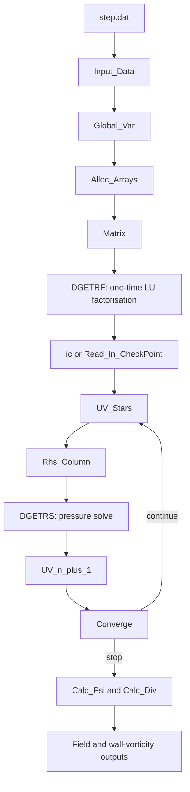

# Software architecture

## Overview

The software is a single Fortran source file organised around one global-data
module, a set of computational subroutines, and the `Step` main program. The
pressure Poisson matrix is assembled and LU-factorised once; its factorisation
is reused at every projection step.



```text
step.dat
   |
   v
Input_Data --> Global_Var --> Alloc_Arrays
                              |
                              v
                           Matrix --> DGETRF
                              |
                              v
                  initial condition/checkpoint
                              |
                              v
  +--------------------------------------------------+
  | time loop                                        |
  | UV_Stars -> Rhs_Column -> DGETRS -> UV_n_plus_1 |
  |       -> CopyVals_Star -> Converge -> CopyVals   |
  +--------------------------------------------------+
                              |
                              v
        Calc_Psi -> Calc_Div -> Wvorticity -> outputs
```

## Principal components

| Component | Responsibility |
| --- | --- |
| `Global_Var` | Grid, physical parameters, filenames, time-step state, pressure matrix, pivots, and field arrays |
| `Input_Data` | Parses `step.dat`, applies defaults, and checks grid divisibility constraints |
| `Alloc_Arrays` | Allocates staggered-grid fields and the dense pressure matrix |
| `Matrix` | Assembles the pressure Poisson operator for the contraction geometry |
| `bc`, `ic` | Boundary and initial conditions |
| `UV_Stars` | Computes intermediate velocities; contains the Stokes, central, upwind, and QUICK branches |
| `Rhs_Column` | Forms the pressure-equation right-hand side |
| `DGETRF`, `DGETRS` | LAPACK LU factorisation and repeated pressure solves |
| `UV_n_plus_1` | Projects the intermediate velocity using the pressure solution |
| `Converge` | Computes the maximum velocity-change residual used for stopping |
| `Calc_Psi` | Integrates the velocity field to obtain streamfunction values |
| `Calc_Div` | Computes the discrete divergence diagnostic |
| `Wvorticity` | Writes wall-vorticity diagnostics |
| `Write_Out_*` | Writes fields and optional checkpoint data |

## Data flow

Velocity components are held on a staggered finite-volume grid. The dense
pressure matrix `A` and pivot vector `IPIV` are prepared before time stepping.
At each step, `UV_Stars` updates `u_star` and `v_star`; `Rhs_Column` maps their
divergence into `p`; LAPACK overwrites `p` with the pressure solution; and
`UV_n_plus_1` produces the projected velocity. State-copy routines distinguish
the previous, intermediate, and next velocity fields.

## Extension points

- Add a convection scheme inside the method branches in `UV_Stars` and assign a
  new `METHOD` value in `Input_Data`.
- Add a diagnostic after projection and call it after `Calc_Div` in `Step`.
- Add a geometry by changing pressure-matrix assembly, boundary conditions, and
  geometry-aware output traversal together. See `extension-guide.md`.

## Known architectural limitations

- Global state is shared through `Global_Var`.
- The pressure matrix is dense, so memory and factorisation cost grow rapidly.
- The numerical source predates structured error codes and automated tests.
- Several output calls remain commented in the recovered main program.
- Geometry assumptions are embedded in matrix assembly, boundary conditions,
  and output loops rather than represented by a separate geometry abstraction.